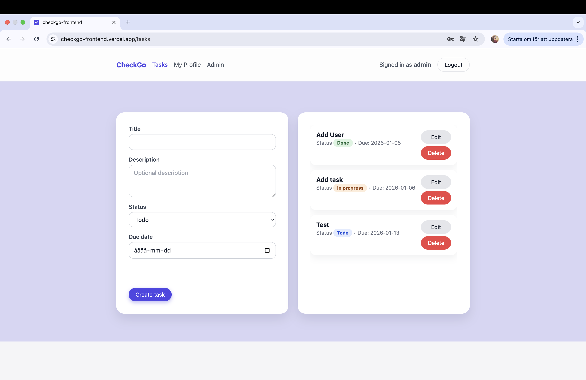
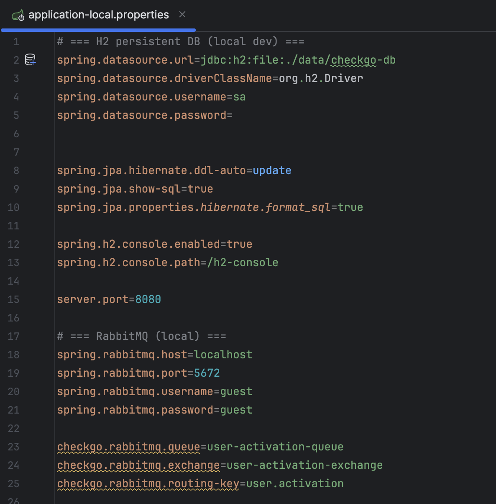
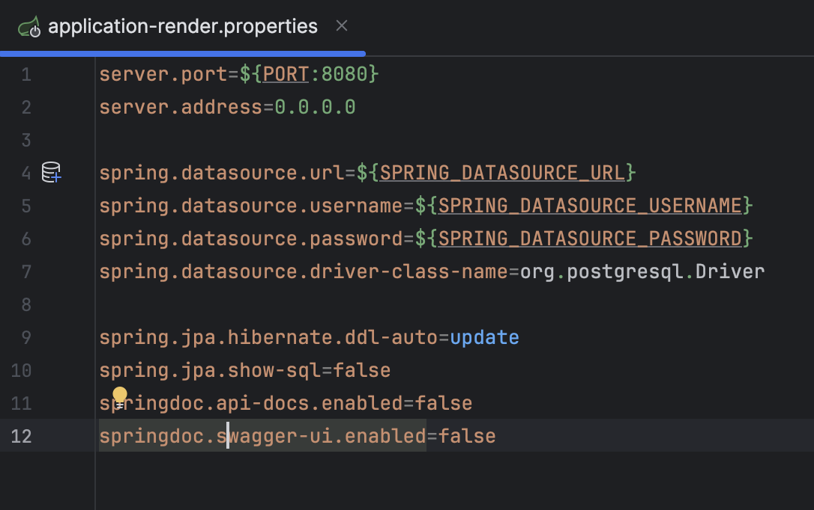
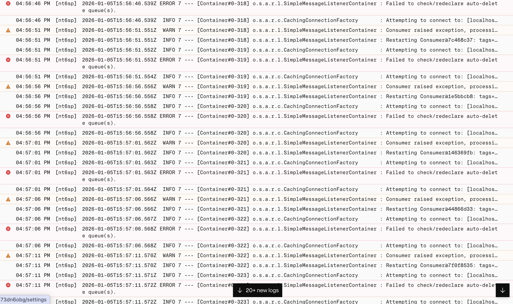
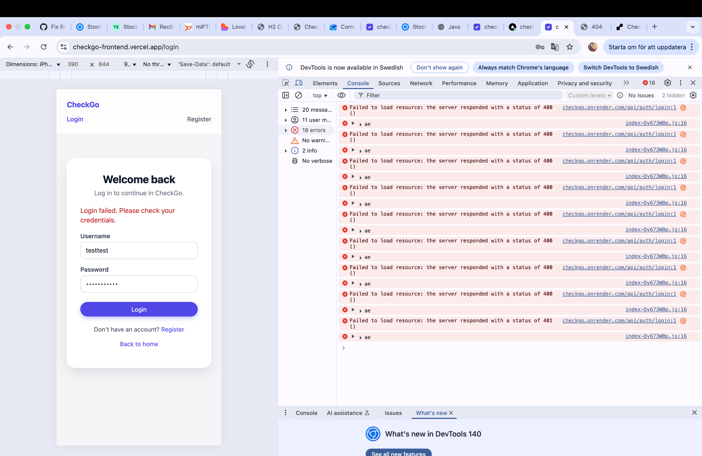

# Logbook – CheckGo Degree Project

This logbook documents the development process of the CheckGo degree project.  
The project is based on an existing backend developed during a Java EE course and focuses on refactoring, environment adaptation, and deployment in a production-like cloud setup.

The emphasis of this logbook is on challenges, decisions, and learning outcomes rather than implementation details.

---

## 2026-12-06 – Separation of backend and frontend responsibilities

### What I did
Refactored the project architecture by separating frontend and backend responsibilities.  
The backend was kept as a pure REST API, while a standalone frontend was created using React (Vite).

### Problem
The original course project included UI elements served directly by the backend, which is common in academic projects but not ideal for real-world architectures.

### Solution
Removed UI concerns from the backend and introduced a separate frontend application that consumes the backend via HTTP.  
The frontend and backend were deployed independently.

### What I learned
Separating frontend and backend responsibilities improves maintainability and scalability and better reflects how modern fullstack systems are structured.

### Evidence

---

## 2026-12-29 – Database migration from H2 to PostgreSQL

### What I did
Migrated the database setup from H2 to PostgreSQL to support persistent storage and production deployment.

### Problem
H2 was suitable for local development but not appropriate for a production-like environment.

### Solution
Configured the application to use different databases depending on the environment:
- H2 for local development
- PostgreSQL for Docker and production

This was implemented using Spring Boot profiles and environment variables, without modifying the application code.

### What I learned
Environment-based configuration allows the same codebase to run in multiple contexts and is essential for reliable cloud deployments.

### Evidence
  

---

## 2026-01-01 – RabbitMQ integration adapted for cloud deployment

### What I did
Deployed the existing backend, which already included a RabbitMQ-based publisher and listener for user activation, to the Render cloud platform.

### Problem
The RabbitMQ integration failed in the cloud environment.  
Application logs showed that the service was still attempting to connect to RabbitMQ via `localhost`, which is not available in cloud deployments.

### Solution
Adapted the existing RabbitMQ integration to work in the cloud by using a managed RabbitMQ service (CloudAMQP).  
Updated the configuration to use environment variables for host, port, username, and password instead of local defaults.

### What I learned
Even when messaging logic is correctly implemented, cloud deployment requires explicit configuration of external dependencies.  
Assumptions that work locally often break when moving to distributed environments.

### Evidence

---

## 2026-01-05 – Login failure for newly created users in production

### What I did
Tested user registration and login flows after deploying the frontend to Vercel and the backend to Render.

### Problem
Newly registered users were unable to log in in production, even though their credentials were correct.  
The frontend displayed login errors and the backend returned 400/401 responses.

### Solution
Identified that user activation depended on the RabbitMQ-based activation flow.  
Because RabbitMQ was misconfigured in the cloud environment, users remained disabled (`enabled = false`).  
After fixing the CloudAMQP configuration, user activation and login worked as expected.

### What I learned
Authentication problems in production are not always caused by authentication logic.  
Infrastructure dependencies and asynchronous processes must be verified when deploying real systems.

### Evidence

---

## 2026-01-06 – Deployment verification through manual testing

### What I did
Verified the deployed application end-to-end in the production environment.

### Problem
Automated tests were not implemented, but the system still required reliable verification.

### Solution
Performed structured manual testing, including:
- User registration and login
- JWT handling
- Role-based access control
- CRUD operations via the frontend

### What I learned
Manual testing can be effective when performed systematically, especially for validating complete user flows across frontend, backend, database, and messaging components.

---

## Summary reflection

This degree project focused on adapting an existing course-based backend into a production-like fullstack application.  
The main challenges were related to configuration, infrastructure, and deployment rather than core business logic.  
Through this process, I gained practical experience in refactoring, environment-specific configuration, and deploying distributed systems in the cloud.
